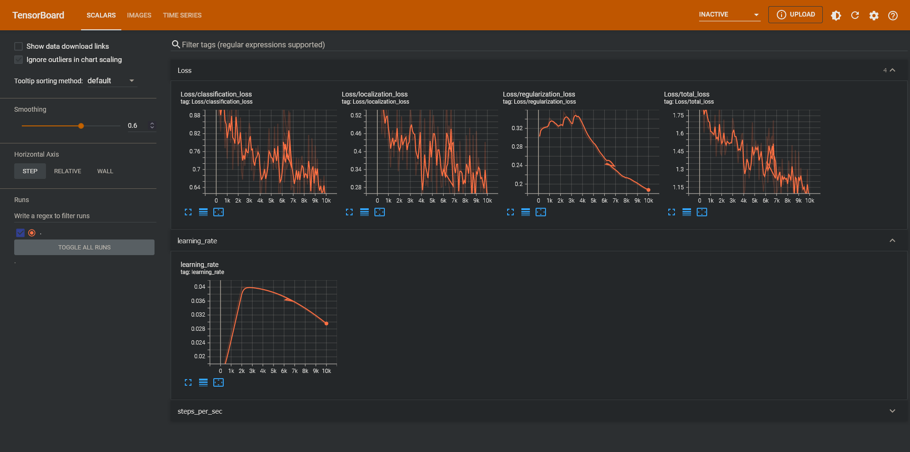

# Plant Disease Detection of 'PlantDoc' Dataset, using Tensorflow Object Detection API, ResNet101 FPN 640x640
- WORK-IN-PROGRESS
- dataset from https://github.com/pratikkayal/PlantDoc-Object-Detection-Dataset
  - original Pascal VOC annotations cleaned up using `./utils/clean-pascalvoc-annotations.ipynb`
- this notebook is referenced from https://github.com/nicknochnack/TFODCourse Nick's tutorial on webcam hand gestures detection
- started with SSD MobileNet FPNLite 320x320 but results weren't good. Attempted ResNet101 based on performance/speed chart here: https://github.com/tensorflow/models/blob/master/research/object_detection/g3doc/tf2_detection_zoo.md
- added image augmentation preprocessing steps to train pipeline
- saved model deployed on Docker, but I haven't built a REST client yet.
- based on model performance so far, will try again with RCNN to see if classification performance is better. but it looks like we need a lot more data, and better quality dataset in general. (I should also try and find other projects using this dataset and look at their results)

#### Train Loss Metrics (after 10000 steps):

#### Eval Metrics:
    Average Precision  (AP) @[ IoU=0.50:0.95 | area=   all | maxDets=100 ] = 0.098
    Average Precision  (AP) @[ IoU=0.50      | area=   all | maxDets=100 ] = 0.136
    Average Precision  (AP) @[ IoU=0.75      | area=   all | maxDets=100 ] = 0.112
    Average Precision  (AP) @[ IoU=0.50:0.95 | area= small | maxDets=100 ] = 0.000
    Average Precision  (AP) @[ IoU=0.50:0.95 | area=medium | maxDets=100 ] = 0.103
    Average Precision  (AP) @[ IoU=0.50:0.95 | area= large | maxDets=100 ] = 0.102
    Average Recall     (AR) @[ IoU=0.50:0.95 | area=   all | maxDets=  1 ] = 0.403
    Average Recall     (AR) @[ IoU=0.50:0.95 | area=   all | maxDets= 10 ] = 0.546
    Average Recall     (AR) @[ IoU=0.50:0.95 | area=   all | maxDets=100 ] = 0.553
    Average Recall     (AR) @[ IoU=0.50:0.95 | area= small | maxDets=100 ] = 0.000
    Average Recall     (AR) @[ IoU=0.50:0.95 | area=medium | maxDets=100 ] = 0.217
    Average Recall     (AR) @[ IoU=0.50:0.95 | area= large | maxDets=100 ] = 0.566
    INFO:tensorflow:Eval metrics at step 10000
    INFO:tensorflow:        + DetectionBoxes_Precision/mAP: 0.098003
    INFO:tensorflow:        + DetectionBoxes_Precision/mAP@.50IOU: 0.135813
    INFO:tensorflow:        + DetectionBoxes_Precision/mAP@.75IOU: 0.112405
    INFO:tensorflow:        + DetectionBoxes_Precision/mAP (small): 0.000000
    INFO:tensorflow:        + DetectionBoxes_Precision/mAP (medium): 0.102733
    INFO:tensorflow:        + DetectionBoxes_Precision/mAP (large): 0.102446
    INFO:tensorflow:        + DetectionBoxes_Recall/AR@1: 0.402812
    INFO:tensorflow:        + DetectionBoxes_Recall/AR@10: 0.546259
    INFO:tensorflow:        + DetectionBoxes_Recall/AR@100: 0.553039
    INFO:tensorflow:        + DetectionBoxes_Recall/AR@100 (small): 0.000000
    INFO:tensorflow:        + DetectionBoxes_Recall/AR@100 (medium): 0.217063
    INFO:tensorflow:        + DetectionBoxes_Recall/AR@100 (large): 0.565969
    INFO:tensorflow:        + Loss/localization_loss: 0.168007
    INFO:tensorflow:        + Loss/classification_loss: 0.604428
    INFO:tensorflow:        + Loss/regularization_loss: 0.185687
    INFO:tensorflow:        + Loss/total_loss: 0.958122
